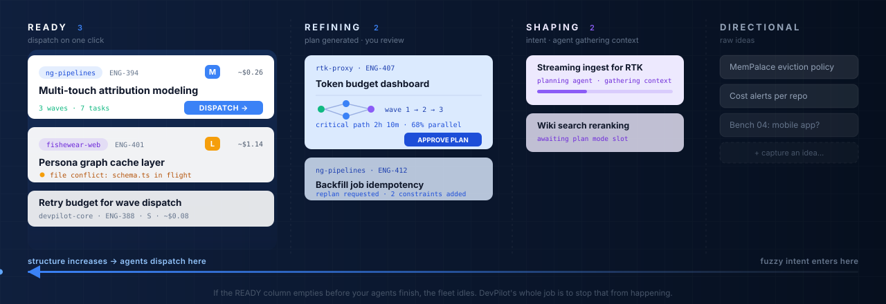
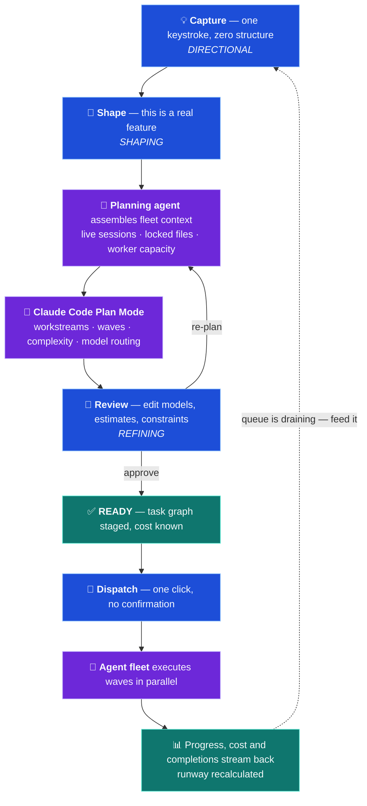
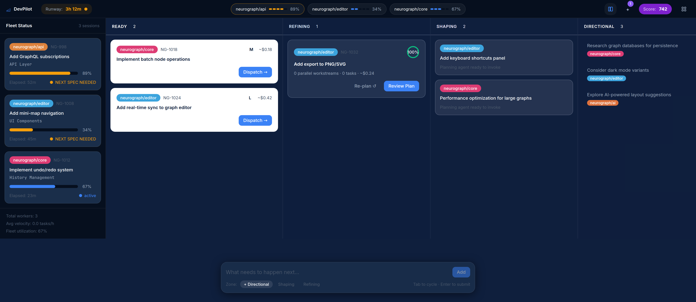
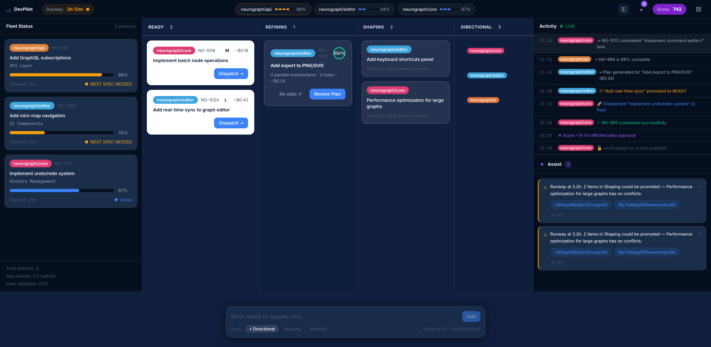
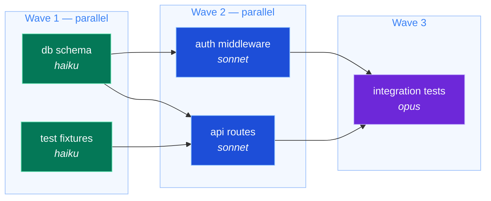
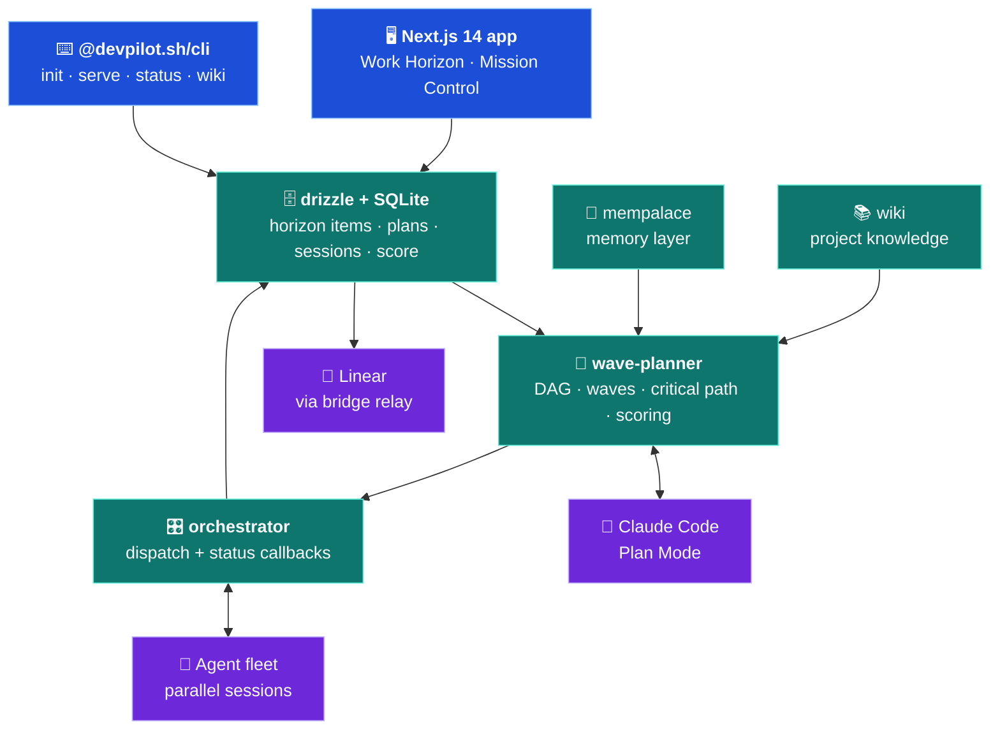
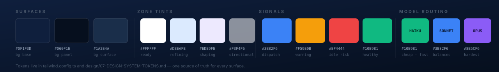

<div align="center">



<br><br>

[](https://github.com/geastham/devpilot/actions/workflows/ci.yml)
[](docs/ROADMAP.md)
[](LICENSE)
[](https://www.typescriptlang.org/)
[](https://nextjs.org/)
[](https://nodejs.org/)
[](#contributing)

### Your agents are faster than your specs.

DevPilot is the cockpit for the person feeding them — a spatial planning surface,
an AI wave planner, and a live view of every agent you have in flight.

**[Quickstart](#-quickstart)** · **[The core idea](#-the-core-idea)** · **[Screens](#-the-product)** · **[Wave planner](#-the-wave-planner)** · **[Benchmarks](#-benchmarks)** · **[Roadmap](docs/ROADMAP.md)**

</div>

---

## 💡 The core idea

Give one engineer a fleet of AI coding agents and the bottleneck moves. It is no longer
*how fast can the machines write code* — it is **how fast can one human produce specs good
enough to hand them.**

Agents drain a queue of well-formed work faster than any person can refill it. When the
queue runs dry, expensive parallel capacity sits idle and you lose the entire advantage of
running a fleet.

> DevPilot treats that queue as the product. Everything in the UI exists to answer one
> question: **will the next agent to finish have something to pick up?**

That number has a name here — **runway**: how long until your ready-to-dispatch queue
empties at the fleet's current velocity. It never leaves the screen.

<br>

## 🛰️ The Work Horizon

The primary surface is a spatial queue. Work enters as a fuzzy one-liner on the right and
gets progressively more structured as it moves left. The left edge is one click from
execution.



| Zone | What lives here | Weight | Exit condition |
|---|---|---|---|
| ⬜ **READY** | Fully specced, task graph staged, cost estimated | Largest, max contrast | You hit **Dispatch** |
| 🟦 **REFINING** | A generated plan waiting on your judgement | Medium, blue tint | You approve the plan |
| 🟪 **SHAPING** | Feature-level intent; planning agent gathering fleet context | Smaller, purple tint | Plan Mode run completes |
| ⬛ **DIRECTIONAL** | Raw idea. Zero structure. Capture in one keystroke | Smallest, low contrast | You promote it |

Alongside the zones, DevPilot watches for the things that actually cost you throughput:

| Signal | Fires when | You see |
|---|---|---|
| **Runway** | Always on | Amber under 4h, red under 2h |
| **Idle warning** | A session passes 70% with nothing queued behind it | Amber pulse on the session card |
| **Idle imminent** | A session passes 90% with an empty READY zone | Red pulse + `IDLE IMMINENT` |
| **File conflict** | A pending spec needs a file another agent has in flight | Amber dot on the item |
| **Coverage gap** | A session will finish before any spec is ready | Red band on the timeline |

<br>

## 🔁 How a feature actually moves



<sub>🟦 you · 🟪 agents · 🟩 system state</sub>

The **fleet context** step is what separates this from pasting a ticket into a chat window.
Before planning starts, DevPilot tells the planner which sessions are live, which files are
locked by an agent mid-edit, and how much worker capacity each repo has — so the plan that
comes back is parallelizable *against the fleet you actually have right now*.

<br>

## 📸 The product

**Work Horizon** — the default surface. Fleet status on the left, four zones across, quick
capture always focused at the bottom.



**Mission Control** — the full-viewport variant. Adds a live activity feed and the agentic
assist panel, which nudges you when the fleet is about to starve.



<sub>Both captured from a local dev server against the repo's seeded demo dataset
(`pnpm --filter @devpilot.sh/core run db:seed`), so you can reproduce these screens in about
two minutes — see [Quickstart](#-quickstart).</sub>

<br>

## ⚡ Quickstart

**Requirements:** Node 20+, pnpm 9+, git.

```bash
git clone https://github.com/geastham/devpilot.git
cd devpilot
pnpm install
```

Create the local SQLite database and load the demo dataset. The DB path resolves relative to
your working directory, so point it at the repo root explicitly:

```bash
export DEVPILOT_SQLITE_PATH="$PWD/.devpilot/data.db"
pnpm --filter @devpilot.sh/core run db:push    # create schema
pnpm --filter @devpilot.sh/core run db:seed    # 8 items, 3 live sessions, activity feed
```

Start the app:

```bash
pnpm dev:app        # Next.js app on http://localhost:3000
# or: pnpm dev      # every package in the monorepo, via turbo
```

Open [localhost:3000](http://localhost:3000) for the Work Horizon, or
[/mission-control](http://localhost:3000/mission-control) for the dense layout.

<details>
<summary><b>Using the CLI against your own repos</b></summary>

<br>

```bash
npm install -g @devpilot.sh/cli

cd your-project
devpilot init          # writes .devpilot/{config.yaml,data.db}
devpilot serve         # the cockpit, on port 3847
```

`devpilot status` prints fleet state, `devpilot config` edits the local config, and
`devpilot wiki` manages the project knowledge base. Full walkthrough in
**[docs/LOCAL-SETUP.md](docs/LOCAL-SETUP.md)**.

</details>

<details>
<summary><b>Connecting real agents and Linear</b></summary>

<br>

DevPilot dispatches through an orchestrator adapter. Point it at an agent runner with
a local orchestrator — see **[docs/AO-INTEGRATION.md](docs/AO-INTEGRATION.md)** — and mirror
horizon items into Linear tickets via the hosted bridge in
**[docs/LINEAR-BRIDGE.md](docs/LINEAR-BRIDGE.md)**. Copy `.env.example` to `.env` for API
keys. Optional: [RTK](https://github.com/rtk-ai/rtk) proxies agent traffic for large token
savings.

</details>

<br>

## 🌊 The wave planner

The most interesting engine in the repo. Give it a feature and it returns a **dependency
DAG collapsed into execution waves** — every task inside a wave can run in parallel, every
wave depends on the one before it. Each task carries a model assignment, so trivial work
goes to Haiku and the genuinely hard task gets Opus.



Wave 1 runs two tasks at once, Wave 2 waits only on what it truly needs, and the critical
path tells you the fastest this feature can possibly ship — before you spend a token on it.

What it computes, all in `packages/core/src/wave-planner`:

| Capability | Detail |
|---|---|
| 🧩 **DAG validation** | Rejects cycles and dangling dependencies before anything dispatches |
| 🛣️ **Critical path** | The longest dependency chain — your real floor on wall-clock time |
| 🌊 **Wave assignment** | Collapses the DAG into the fewest fully-parallel batches |
| 🎚️ **Model routing** | Per-task Haiku / Sonnet / Opus assignment with a cost estimate |
| 📈 **Plan scoring** | Grades parallelization quality, then refines the plan against its own score |
| ♻️ **Re-optimization** | Edit estimates or constraints and re-plan without starting over |

Spec: **[spec/WAVE-PLANNER.md](spec/WAVE-PLANNER.md)**.

<br>

## 🧪 Benchmarks

DevPilot ships a harness that answers the obvious skeptical question: *does orchestrating
agents beat just running one?* It executes the same PRD twice — once with a single baseline
agent, once through DevPilot's wave planner — and scores both.

| # | Project | Codename | Planning challenge it probes |
|---|---|---|---|
| 01 | CLI static site generator | **Forgepress** | Plugin parallelism, interface gating |
| 02 | REST API with auth + webhooks | **Taskforge** | Cross-cutting concerns, converging critical paths |
| 03 | React analytics dashboard | **InsightBoard** | Multi-context ETL + API + UI, horizontal vs vertical strategy |

```bash
devpilot-bench list                 # available benchmarks
devpilot-bench run 01 --mode both   # baseline vs orchestrated
devpilot-bench compare <a> <b>      # diff two runs
devpilot-bench trend                # scores over time
```

Real subprocess execution with acceptance tests, token accounting and cost math — needs the
`claude` CLI and an API key. Details in **[benchmarks/README.md](benchmarks/README.md)** and
**[spec/BENCHMARK-SUITE.md](spec/BENCHMARK-SUITE.md)**.

<br>

## 🏗️ Architecture



<sub>🟦 surfaces · 🟩 `@devpilot.sh/core` · 🟪 outside the box</sub>

| Package | Role |
|---|---|
| [`@devpilot.sh/core`](packages/core) | Schemas, wave planner, orchestrator, integrations, memory, wiki |
| [`@devpilot.sh/cli`](packages/cli) | `devpilot` command; `serve` runs the bundled cockpit |
| [`@devpilot.sh/ui`](packages/ui) | Shared component library |
| [`@devpilot.sh/benchmarks`](packages/benchmarks) | `devpilot-bench` harness, scoring, trend analysis |
| [`@devpilot.sh/bridge-protocol`](packages/bridge-protocol) | The bridge wire contract (MIT) — implement it to run your own bridge |
| [`@devpilot.sh/bridge-client`](packages/bridge-client) | Connects a machine to a DevPilot bridge |

Stack: TypeScript · Next.js 14 (App Router) · React 18 · Tailwind · Zustand · Drizzle ORM ·
SQLite · Turborepo · Vitest · SSE for live fleet updates.

<br>

## 🎨 Design system

One dark, high-contrast visual language. Zone tint encodes readiness, accent color encodes
urgency, and model color is consistent everywhere a task appears.



Every token lives in [`tailwind.config.ts`](tailwind.config.ts), documented surface by
surface in [`design/`](design) — nine prompt-library specs covering each screen, down to the
animation timings.

<br>

## 📍 Project status

DevPilot is **alpha** and honest about it. The planning half is real; the execution
hand-off is actively being closed.

| Area | State |
|---|---|
| Work Horizon surface, zones, capture, promote flows | ✅ Built, DB-backed |
| Wave planner — DAG, critical path, waves, scoring, re-optimize | ✅ Built on real model calls |
| Fleet status, activity feed, assist panel, Conductor Score | ✅ Built |
| Mission Control + Planning Horizon layouts | ✅ Shipped |
| Benchmark suite | ✅ Complete; not yet in CI |
| **Dispatch → live agents** | 🔴 The gap — orchestrator bridge is placeholder in the Next app |
| Plan-review plan generation | 🟡 Still template-based; wave planner beside it is real AI |
| Pause / resume, DAG visualization, replan modal | 🟡 UI present, endpoints missing |
| Conversational planning mode | ❌ Not started |

The full teardown — file-by-file, with the prioritized path to closing the loop — is in
**[docs/ROADMAP.md](docs/ROADMAP.md)**. It is the best single document to read if you want
to contribute something that matters.

<br>

## 📚 Documentation

| Doc | What's in it |
|---|---|
| [docs/COCKPIT.md](docs/COCKPIT.md) | The work horizon, instruments, motion language, wave planning |
| [docs/LOCAL-SETUP.md](docs/LOCAL-SETUP.md) | Install, init, serve, configuration |
| [docs/API-REFERENCE.md](docs/API-REFERENCE.md) | HTTP surface |
| [docs/ROADMAP.md](docs/ROADMAP.md) | Current state and prioritized next work |
| [docs/AO-INTEGRATION.md](docs/AO-INTEGRATION.md) | Wiring an agent orchestrator |
| [docs/LINEAR-BRIDGE.md](docs/LINEAR-BRIDGE.md) | Linear sync via the hosted bridge |
| [spec/DESIGN.md](spec/DESIGN.md) | The full TRD — mental model, data model, every surface |
| [spec/WAVE-PLANNER.md](spec/WAVE-PLANNER.md) | Wave planning algorithm and phases |
| [spec/BENCHMARK-SUITE.md](spec/BENCHMARK-SUITE.md) | Benchmark methodology and scoring |
| [design/](design) | Per-surface design specs and tokens |

<br>

## 🤝 Contributing

Issues and PRs are welcome. The highest-leverage work is listed under **Tier 1** in
[docs/ROADMAP.md](docs/ROADMAP.md) — closing the dispatch loop so a plan approved in the UI
actually starts agents.

```bash
pnpm test          # vitest across packages
pnpm typecheck     # tsc --noEmit
pnpm lint          # eslint
pnpm build         # turbo build
```

<br>

## License

[MIT](LICENSE) © Open Conjecture. Every published package carries the same
license — see the `license` field in each [`packages/`](packages) manifest.

<div align="center">
<br>
<sub>Built by <b>Open Conjecture</b> · If you run a fleet of coding agents, the queue is the product.</sub>
</div>
