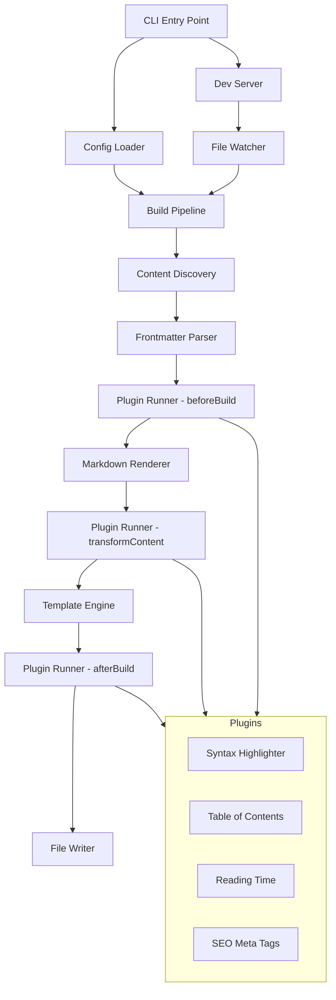

# Benchmark 01: CLI Static Site Generator — "Forgepress"

## 1. Project Overview

### What We're Building

**Forgepress** is a CLI-based static site generator that transforms a directory of Markdown files into a fully rendered HTML website. It supports frontmatter metadata, a Handlebars-compatible template engine, a plugin system for content transformation, and a local dev server with file watching.

### Why This Benchmark

This project has a naturally layered architecture with clear dependency boundaries. The plugin system creates a well-defined interface contract that enables parallel implementation of independent plugins. The CLI layer, config system, and build pipeline form a sequential spine, while content processors and plugins fan out as parallelizable leaves.

**Planning challenge**: The planner must recognize that the plugin interface contract is a gating dependency — individual plugins can't be built until the contract is defined, but once it is, all plugins are independent.

### Scope Boundaries

**IN SCOPE:**
- CLI with `build`, `serve`, and `init` commands
- Markdown → HTML rendering with frontmatter extraction
- Handlebars-style template engine with layouts and partials
- Plugin system with lifecycle hooks (beforeBuild, transformContent, afterBuild)
- 4 built-in plugins: syntax highlighting, table of contents, reading time, SEO meta tags
- Local dev server (Express) with file watcher (chokidar)
- Configuration via `forgepress.config.js`

**OUT OF SCOPE:**
- Image optimization
- CSS/JS bundling
- Deployment
- Database or CMS integration
- Incremental builds (full rebuild every time is fine)

---

## 2. Architecture & Design

### System Architecture



### Component Inventory

| Component | Responsibility | Dependencies |
|-----------|---------------|--------------|
| `cli.js` | Parse CLI args, dispatch commands | ConfigLoader |
| `config.js` | Load and validate `forgepress.config.js` | None |
| `pipeline.js` | Orchestrate the full build sequence | ContentDiscovery, FrontmatterParser, PluginRunner, MarkdownRenderer, TemplateEngine, FileWriter |
| `discovery.js` | Recursively find `.md` files in content dir | Config (for content dir path) |
| `frontmatter.js` | Extract YAML frontmatter from markdown files | None |
| `markdown.js` | Convert markdown to HTML | None |
| `templates.js` | Handlebars-style template rendering with layouts | Config (for template dir path) |
| `plugins.js` | Plugin loader, lifecycle hook executor | Config (for plugin list) |
| `writer.js` | Write rendered HTML to output directory | Config (for output dir path) |
| `server.js` | Express dev server + chokidar file watcher | Pipeline (for rebuild trigger) |
| `plugin-syntax.js` | Syntax highlighting for code blocks | Plugin Interface |
| `plugin-toc.js` | Generate table of contents from headings | Plugin Interface |
| `plugin-reading-time.js` | Calculate and inject reading time | Plugin Interface |
| `plugin-seo.js` | Generate meta tags from frontmatter | Plugin Interface |

### Data Flow

1. CLI parses command (`build` / `serve` / `init`)
2. ConfigLoader reads `forgepress.config.js`, merges with defaults
3. ContentDiscovery walks the content directory, returns array of file paths
4. For each file:
   a. FrontmatterParser extracts metadata + raw markdown body
   b. PluginRunner executes `beforeBuild` hooks (can modify frontmatter)
   c. MarkdownRenderer converts markdown body → HTML fragment
   d. PluginRunner executes `transformContent` hooks (can modify HTML)
   e. TemplateEngine wraps HTML in layout template, injects metadata
   f. PluginRunner executes `afterBuild` hooks (can modify final HTML)
   g. FileWriter writes final HTML to output directory, preserving directory structure

### Technology Constraints

- **Runtime**: Node.js (no TypeScript compilation — plain `.js` with JSDoc types)
- **Dependencies**: Only these npm packages are permitted:
  - `commander` (CLI parsing)
  - `gray-matter` (frontmatter extraction)
  - `marked` (markdown rendering)
  - `handlebars` (template engine)
  - `highlight.js` (syntax highlighting)
  - `express` (dev server)
  - `chokidar` (file watching)
- **No TypeScript, no Babel, no build step for the tool itself**

---

## 3. Dependency Graph

### Component Dependencies (Directed Acyclic Graph)

```
config.js           → (none)
frontmatter.js      → (none)
markdown.js         → (none)
discovery.js        → config.js
templates.js        → config.js
writer.js           → config.js
plugins.js          → config.js
plugin-syntax.js    → plugins.js (interface only)
plugin-toc.js       → plugins.js (interface only)
plugin-reading-time.js → plugins.js (interface only)
plugin-seo.js       → plugins.js (interface only)
pipeline.js         → discovery.js, frontmatter.js, markdown.js, templates.js, plugins.js, writer.js
cli.js              → config.js, pipeline.js
server.js           → pipeline.js
```

### Ground-Truth Optimal Wave Decomposition

#### Wave 1: Foundation (Sequential — must complete before anything else)
| Task | Files | Est. Time | Rationale |
|------|-------|-----------|-----------|
| Project scaffold | `package.json`, directory structure | 30s | Everything depends on this |
| Config module | `src/config.js` | 45s | 6 components depend on config |
| Frontmatter parser | `src/frontmatter.js` | 30s | No dependencies, leaf node |
| Markdown renderer | `src/markdown.js` | 30s | No dependencies, leaf node |

**Wave 1 parallelism**: Config is gating, but frontmatter and markdown have zero dependencies and can build in parallel with config.

#### Wave 2: Core Infrastructure (Parallelizable — all depend only on config)
| Task | Files | Est. Time | Rationale |
|------|-------|-----------|-----------|
| Content discovery | `src/discovery.js` | 30s | Depends on config |
| Template engine | `src/templates.js` | 60s | Depends on config, most complex in this wave |
| Plugin system (interface + loader) | `src/plugins.js` | 45s | Depends on config, gates all plugins |
| File writer | `src/writer.js` | 30s | Depends on config |

**Wave 2 parallelism**: All 4 tasks depend only on config (Wave 1). Full parallelism possible.

#### Wave 3: Plugins (Fully Parallel — all depend only on plugin interface)
| Task | Files | Est. Time | Rationale |
|------|-------|-----------|-----------|
| Syntax highlighter plugin | `src/plugins/syntax.js` | 30s | Depends on plugin interface |
| Table of contents plugin | `src/plugins/toc.js` | 45s | Depends on plugin interface |
| Reading time plugin | `src/plugins/reading-time.js` | 20s | Depends on plugin interface, trivial |
| SEO meta tags plugin | `src/plugins/seo.js` | 30s | Depends on plugin interface |

**Wave 3 parallelism**: 100% parallel. All plugins implement the same interface independently.

#### Wave 4: Integration (Sequential — wires everything together)
| Task | Files | Est. Time | Rationale |
|------|-------|-----------|-----------|
| Build pipeline | `src/pipeline.js` | 60s | Depends on discovery, frontmatter, markdown, templates, plugins, writer |
| CLI entry point | `src/cli.js`, `bin/forgepress` | 45s | Depends on config, pipeline |
| Dev server + watcher | `src/server.js` | 45s | Depends on pipeline |

**Wave 4 parallelism**: Pipeline must come first. CLI and server can parallelize after pipeline.

#### Wave 5: Testing & Validation
| Task | Files | Est. Time | Rationale |
|------|-------|-----------|-----------|
| Integration tests | `tests/` | 60s | Run full build against fixtures, validate output |
| Fix any failures | Various | Variable | Iterate until acceptance criteria pass |

### Critical Path

```
config → plugin-system → (any plugin) → pipeline → cli
```

Estimated critical path time: ~4 minutes with good parallelism, ~7 minutes sequential.

---

## 4. Detailed Component Specifications

### 4.1 Config Module (`src/config.js`)

**Exports**: `loadConfig(rootDir?: string): ForgeConfig`

**Default configuration**:
```javascript
{
  contentDir: './content',
  outputDir: './dist',
  templateDir: './templates',
  plugins: ['syntax', 'toc', 'reading-time', 'seo'],
  site: {
    title: 'My Forgepress Site',
    description: '',
    baseUrl: '/'
  },
  server: {
    port: 3000
  }
}
```

**Behavior**:
- Look for `forgepress.config.js` in `rootDir` (defaults to `process.cwd()`)
- Deep merge user config with defaults
- Resolve all directory paths to absolute paths
- Throw descriptive error if config file exists but is malformed
- Return frozen config object (immutable)

**File**: `src/config.js`

---

### 4.2 Frontmatter Parser (`src/frontmatter.js`)

**Exports**: `parseFrontmatter(rawContent: string): { data: object, content: string }`

**Behavior**:
- Use `gray-matter` to extract YAML frontmatter
- Required frontmatter fields: `title` (string)
- Optional fields: `date` (ISO string), `tags` (array), `layout` (string, defaults to `'default'`), `draft` (boolean, defaults to `false`), `description` (string), `slug` (string)
- If `title` is missing, throw error with filename context
- If `draft: true`, return a `draft` flag so pipeline can skip

**File**: `src/frontmatter.js`

---

### 4.3 Markdown Renderer (`src/markdown.js`)

**Exports**: `renderMarkdown(markdownString: string): string`

**Behavior**:
- Use `marked` with default options
- Enable GitHub-Flavored Markdown (tables, strikethrough, task lists)
- Return raw HTML string (no wrapping tags)
- Configure `marked` to add `id` attributes to headings (for TOC plugin)
  - ID format: lowercase, hyphens for spaces, strip special chars
  - Example: `## Hello World!` → `<h2 id="hello-world">Hello World!</h2>`

**File**: `src/markdown.js`

---

### 4.4 Content Discovery (`src/discovery.js`)

**Exports**: `discoverContent(contentDir: string): ContentFile[]`

**ContentFile shape**:
```javascript
{
  absolutePath: string,    // Full filesystem path
  relativePath: string,    // Relative to contentDir
  outputPath: string,      // Relative output path (.md → .html)
  slug: string             // URL-friendly slug derived from path
}
```

**Behavior**:
- Recursively walk `contentDir`
- Include only `.md` files
- Ignore files/dirs starting with `_` or `.`
- Compute `outputPath` by replacing `.md` with `.html`
- Compute `slug` from relative path (strip extension, lowercase)
- Sort results alphabetically by `relativePath` (deterministic output)

**File**: `src/discovery.js`

---

### 4.5 Template Engine (`src/templates.js`)

**Exports**: `createTemplateEngine(templateDir: string): TemplateEngine`

**TemplateEngine interface**:
```javascript
{
  render(layoutName: string, context: object): string
}
```

**Context object passed to templates**:
```javascript
{
  title: string,         // From frontmatter
  content: string,       // Rendered HTML body
  date: string | null,
  tags: string[],
  site: object,          // From config.site
  meta: object           // Any additional frontmatter fields
}
```

**Template structure**:
- Templates are `.hbs` files in `templateDir`
- Must support a `default.hbs` layout
- Must support `{{> partialName}}` partial syntax
- Partials live in `templateDir/partials/`
- The `{{{content}}}` triple-stache renders unescaped HTML body

**Required default template** (`templates/default.hbs`):
```handlebars
<!DOCTYPE html>
<html lang="en">
<head>
    <meta charset="UTF-8">
    <meta name="viewport" content="width=device-width, initial-scale=1.0">
    <title>{{title}} | {{site.title}}</title>
    {{#if meta.seo}}
    {{{meta.seo}}}
    {{/if}}
</head>
<body>
    <header>
        <h1>{{site.title}}</h1>
        <nav>{{> navigation}}</nav>
    </header>
    <main>
        <article>
            <h1>{{title}}</h1>
            {{#if date}}<time>{{date}}</time>{{/if}}
            {{#if meta.readingTime}}<span class="reading-time">{{meta.readingTime}}</span>{{/if}}
            {{#if meta.toc}}<nav class="toc">{{{meta.toc}}}</nav>{{/if}}
            {{{content}}}
        </article>
    </main>
    <footer>
        {{#if tags}}
        <div class="tags">
            {{#each tags}}<span class="tag">{{this}}</span>{{/each}}
        </div>
        {{/if}}
    </footer>
</body>
</html>
```

**File**: `src/templates.js`

---

### 4.6 Plugin System (`src/plugins.js`)

**Exports**:
```javascript
{
  loadPlugins(pluginNames: string[], pluginDir?: string): Plugin[],
  runHook(plugins: Plugin[], hookName: string, context: object): object
}
```

**Plugin Interface Contract** (each plugin exports):
```javascript
{
  name: string,
  hooks: {
    beforeBuild?: (context: BuildContext) => BuildContext,
    transformContent?: (html: string, frontmatter: object) => { html: string, meta?: object },
    afterBuild?: (finalHtml: string, frontmatter: object) => string
  }
}
```

**BuildContext shape** (passed to beforeBuild):
```javascript
{
  files: ContentFile[],      // All discovered content files
  config: ForgeConfig,       // Full config object
  frontmatter: object        // Current file's frontmatter (mutable)
}
```

**Behavior**:
- `loadPlugins` resolves plugins by name from `src/plugins/` directory
- Plugins execute in array order (config order matters)
- `runHook` iterates plugins, calls the named hook if it exists
- Each hook receives the output of the previous plugin (chain pattern)
- If a plugin hook throws, log a warning and continue with previous value (graceful degradation)
- `transformContent` hooks can return a `meta` object that gets merged into the template context

**File**: `src/plugins.js`

---

### 4.7 Plugin: Syntax Highlighter (`src/plugins/syntax.js`)

**Hook**: `transformContent`

**Behavior**:
- Find all `<code class="language-*">` blocks in the HTML
- Apply `highlight.js` auto-detection or use the specified language
- Wrap output in highlight.js-compatible class names
- Return modified HTML

**File**: `src/plugins/syntax.js`

---

### 4.8 Plugin: Table of Contents (`src/plugins/toc.js`)

**Hook**: `transformContent`

**Behavior**:
- Parse all `<h2>` and `<h3>` tags from rendered HTML
- Build a nested list structure
- Return `meta.toc` as an HTML string (`<ul>` with `<li>` and `<a href="#id">`)
- Only generate TOC if there are 2+ headings

**File**: `src/plugins/toc.js`

---

### 4.9 Plugin: Reading Time (`src/plugins/reading-time.js`)

**Hook**: `beforeBuild`

**Behavior**:
- Strip HTML tags from content, count words
- Calculate reading time at 200 words/minute
- Set `meta.readingTime` to formatted string (e.g., "3 min read")

**File**: `src/plugins/reading-time.js`

---

### 4.10 Plugin: SEO Meta Tags (`src/plugins/seo.js`)

**Hook**: `afterBuild`

**Behavior**:
- Generate `<meta>` tags for: `description`, `og:title`, `og:description`, `og:type` (article)
- Use frontmatter `description` if available, else first 160 chars of content
- Inject into `<head>` section of final HTML (find `</head>` and insert before)
- Return modified final HTML

**File**: `src/plugins/seo.js`

---

### 4.11 Build Pipeline (`src/pipeline.js`)

**Exports**: `build(config: ForgeConfig): BuildResult`

**BuildResult shape**:
```javascript
{
  filesProcessed: number,
  filesSkipped: number,    // drafts
  outputDir: string,
  errors: string[]
}
```

**Behavior**:
1. Clean output directory (rm -rf, then mkdir)
2. Discover content files
3. Load plugins
4. For each content file:
   a. Read raw file content
   b. Parse frontmatter → skip if draft
   c. Run `beforeBuild` hooks
   d. Render markdown to HTML
   e. Run `transformContent` hooks
   f. Render through template engine
   g. Run `afterBuild` hooks
   h. Write to output directory
5. Copy `templates/static/` to `outputDir/static/` if exists
6. Return build result summary

**File**: `src/pipeline.js`

---

### 4.12 CLI Entry Point (`src/cli.js` + `bin/forgepress`)

**Commands**:

| Command | Description | Options |
|---------|-------------|---------|
| `forgepress build` | Run full build | `--config <path>`, `--verbose` |
| `forgepress serve` | Start dev server + watch | `--port <number>`, `--config <path>` |
| `forgepress init` | Scaffold new project | `--name <string>` |

**`init` scaffold output**:
```
<name>/
├── content/
│   └── index.md          (sample "Hello World" post)
├── templates/
│   ├── default.hbs
│   └── partials/
│       └── navigation.hbs
├── forgepress.config.js
└── package.json
```

**File**: `src/cli.js`, `bin/forgepress` (shebang script that requires cli.js)

---

### 4.13 Dev Server (`src/server.js`)

**Exports**: `startServer(config: ForgeConfig, pipeline: Pipeline): void`

**Behavior**:
- Run initial build
- Start Express static server serving `outputDir`
- Watch `contentDir` and `templateDir` with chokidar
- On file change: re-run full build, log rebuild time
- Log server URL on start: `Forgepress serving at http://localhost:<port>`

**File**: `src/server.js`

---

## 5. Input Fixtures

### Content Files

**`fixtures/content/index.md`**:
```markdown
---
title: Welcome to Forgepress
date: 2024-01-15
tags: [welcome, getting-started]
description: Your first Forgepress site is up and running.
---

# Welcome

This is your new **Forgepress** site. Edit this file to get started.

## Features

Forgepress supports all the basics:

- Markdown rendering with GFM
- Frontmatter metadata
- Template layouts
- Plugins for common needs

## Code Example

Here's a JavaScript snippet:

```javascript
const greeting = 'Hello, Forgepress!';
console.log(greeting);
`` `

## Next Steps

Check out the [documentation](#) to learn more about customizing your site.
```

**`fixtures/content/blog/first-post.md`**:
```markdown
---
title: My First Blog Post
date: 2024-02-01
tags: [blog, tutorial]
layout: default
description: A deep dive into building with Forgepress.
---

## Getting Started

Writing content with Forgepress is straightforward. Create a `.md` file in your content directory, add some frontmatter, and you're good to go.

### Directory Structure

Your content directory mirrors your URL structure:

| Path | URL |
|------|-----|
| `content/index.md` | `/` |
| `content/blog/first-post.md` | `/blog/first-post` |
| `content/about.md` | `/about` |

### Working with Frontmatter

Every content file starts with YAML frontmatter between `---` delimiters. The `title` field is required; everything else is optional.

## Advanced Topics

### Custom Layouts

You can specify a different layout in your frontmatter. Just create a matching `.hbs` file in your templates directory.

### Plugin System

Forgepress plugins can hook into three lifecycle events:

1. **beforeBuild** — Modify frontmatter before rendering
2. **transformContent** — Transform HTML after markdown rendering  
3. **afterBuild** — Modify final HTML output
```

**`fixtures/content/about.md`**:
```markdown
---
title: About This Site
tags: [meta]
---

## About

This is a sample about page for testing the Forgepress static site generator.

It has multiple headings to test the table of contents plugin.

## The Team

Just a benchmark test, but if this were real, we'd list the team here.

## Contact

Reach out at test@example.com.
```

**`fixtures/content/drafts/unpublished.md`**:
```markdown
---
title: Draft Post
draft: true
---

This should NOT appear in the built output.
```

### Template Files

**`fixtures/templates/default.hbs`**: (Use the template defined in section 4.5)

**`fixtures/templates/partials/navigation.hbs`**:
```handlebars
<a href="/">Home</a> | <a href="/about.html">About</a> | <a href="/blog/first-post.html">Blog</a>
```

### Config File

**`fixtures/forgepress.config.js`**:
```javascript
module.exports = {
  contentDir: './content',
  outputDir: './dist',
  templateDir: './templates',
  plugins: ['syntax', 'toc', 'reading-time', 'seo'],
  site: {
    title: 'Forgepress Benchmark Site',
    description: 'A test site for benchmarking DevPilot.',
    baseUrl: '/'
  }
};
```

---

## 6. Acceptance Criteria

### AC-01: Build Command Produces Output
```bash
# Run build
node src/cli.js build --config ./forgepress.config.js

# Verify output directory exists
test -d ./dist && echo "PASS" || echo "FAIL"

# Verify expected files
test -f ./dist/index.html && echo "PASS: index.html" || echo "FAIL: index.html"
test -f ./dist/about.html && echo "PASS: about.html" || echo "FAIL: about.html"
test -f ./dist/blog/first-post.html && echo "PASS: first-post.html" || echo "FAIL: first-post.html"
```

### AC-02: Draft Posts Excluded
```bash
# Draft should NOT be in output
test ! -f ./dist/drafts/unpublished.html && echo "PASS: draft excluded" || echo "FAIL: draft included"
```

### AC-03: Frontmatter Rendered in Templates
```bash
# Title should appear in output
grep -q "<title>Welcome to Forgepress | Forgepress Benchmark Site</title>" ./dist/index.html && echo "PASS" || echo "FAIL"
```

### AC-04: Markdown Rendered to HTML
```bash
# Check for rendered HTML elements
grep -q "<h2" ./dist/index.html && echo "PASS: headings" || echo "FAIL: headings"
grep -q "<strong>Forgepress</strong>" ./dist/index.html && echo "PASS: bold" || echo "FAIL: bold"
grep -q "<li>" ./dist/index.html && echo "PASS: lists" || echo "FAIL: lists"
```

### AC-05: Syntax Highlighting Applied
```bash
# Code blocks should have highlight.js classes
grep -q "hljs" ./dist/index.html && echo "PASS: syntax highlighting" || echo "FAIL: syntax highlighting"
```

### AC-06: Table of Contents Generated
```bash
# TOC should be present on pages with 2+ headings
grep -q 'class="toc"' ./dist/index.html && echo "PASS: TOC present" || echo "FAIL: TOC missing"
grep -q 'href="#' ./dist/index.html && echo "PASS: TOC links" || echo "FAIL: TOC links"
```

### AC-07: Reading Time Calculated
```bash
# Reading time should appear
grep -q "min read" ./dist/index.html && echo "PASS: reading time" || echo "FAIL: reading time"
```

### AC-08: SEO Meta Tags Injected
```bash
# OG tags should be in head
grep -q 'og:title' ./dist/index.html && echo "PASS: og:title" || echo "FAIL: og:title"
grep -q 'og:description' ./dist/index.html && echo "PASS: og:description" || echo "FAIL: og:description"
```

### AC-09: GFM Tables Rendered
```bash
# Tables should render in blog post
grep -q "<table>" ./dist/blog/first-post.html && echo "PASS: tables" || echo "FAIL: tables"
```

### AC-10: Navigation Partial Rendered
```bash
# Navigation links should appear
grep -q 'href="/about.html"' ./dist/index.html && echo "PASS: nav partial" || echo "FAIL: nav partial"
```

### Full Acceptance Script

```bash
#!/bin/bash
# acceptance.sh — Run all acceptance criteria
PASS=0
FAIL=0

check() {
    if eval "$1"; then
        echo "  PASS: $2"
        ((PASS++))
    else
        echo "  FAIL: $2"
        ((FAIL++))
    fi
}

echo "=== Forgepress Acceptance Tests ==="

# Build
node src/cli.js build --config ./forgepress.config.js 2>/dev/null

check 'test -d ./dist' "Output directory exists"
check 'test -f ./dist/index.html' "index.html generated"
check 'test -f ./dist/about.html' "about.html generated"
check 'test -f ./dist/blog/first-post.html' "first-post.html generated"
check 'test ! -f ./dist/drafts/unpublished.html' "Draft post excluded"
check 'grep -q "<title>Welcome to Forgepress" ./dist/index.html' "Title in template"
check 'grep -q "<h2" ./dist/index.html' "Headings rendered"
check 'grep -q "<strong>" ./dist/index.html' "Bold rendered"
check 'grep -q "hljs" ./dist/index.html' "Syntax highlighting"
check 'grep -q "toc" ./dist/index.html' "Table of contents"
check 'grep -q "min read" ./dist/index.html' "Reading time"
check 'grep -q "og:title" ./dist/index.html' "SEO meta tags"
check 'grep -q "<table>" ./dist/blog/first-post.html' "GFM tables"
check 'grep -q "href=\"/about.html\"" ./dist/index.html' "Navigation partial"

echo ""
echo "=== Results: $PASS passed, $FAIL failed ==="
exit $FAIL
```

---

## 7. Evaluation Rubric

### Optimal Wave Plan Score (25 points)

| Score | Criteria |
|-------|----------|
| 25 | Agent's wave plan matches ground truth within 1 task placement |
| 20 | Agent correctly identifies all gating dependencies but sub-optimal grouping |
| 15 | Agent builds sequentially but in correct order |
| 10 | Agent misses plugin parallelism opportunity |
| 5 | Agent has dependency violations (builds dependent before dependency) |
| 0 | Agent builds in random order with no clear wave structure |

### Key Decision Points to Watch

1. **Does the planner recognize config as a gating dependency?** Config should be Wave 1. If plugins or templates are attempted before config, that's a dependency error.

2. **Does the planner parallelize the 4 plugins?** This is the biggest parallelism win. All 4 plugins implement the same interface and have zero inter-dependencies.

3. **Does the planner build the plugin interface before individual plugins?** `plugins.js` must exist before any `plugin-*.js` file can be tested.

4. **Does the planner defer the pipeline to a late wave?** `pipeline.js` imports nearly everything — it should be among the last components built.

5. **Does the planner create fixtures before tests?** If acceptance tests run before fixture files are in place, they'll all fail.

6. **How specific are the Claude Code prompts?** A good prompt for the syntax highlighter plugin should reference the plugin interface contract from section 4.6, mention `highlight.js`, and specify the `transformContent` hook. A vague prompt like "build a syntax highlighting plugin" is a planning failure.
