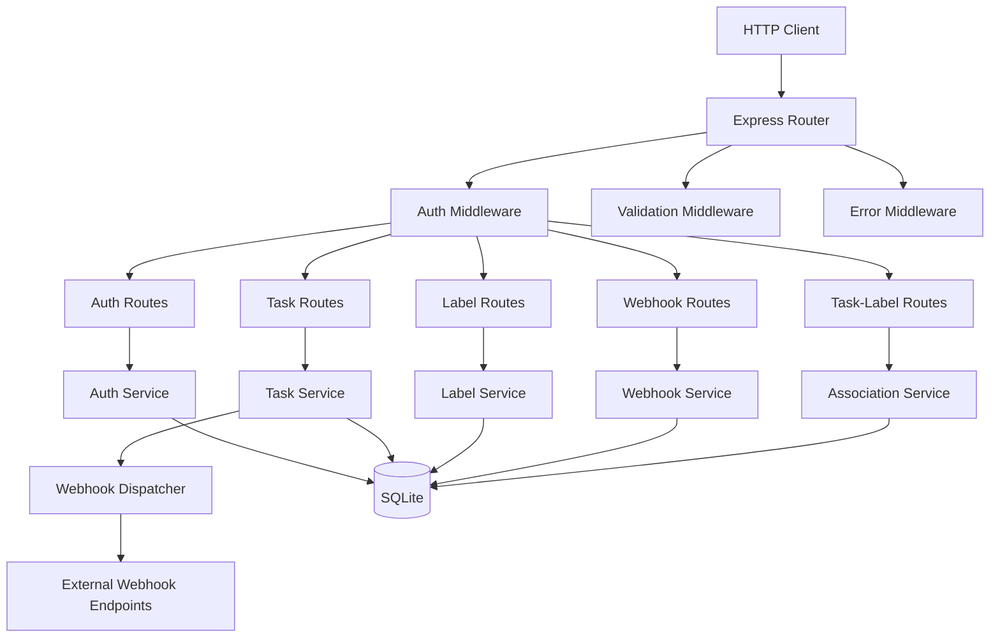

# Benchmark 02: REST API with Auth & Webhooks — "Taskforge"

## 1. Project Overview

### What We're Building

**Taskforge** is a RESTful task management API with JWT authentication, full CRUD on tasks and labels, relational task-label associations, and an outbound webhook system that fires on task state transitions. It uses SQLite for storage (zero external infrastructure) and Express for the HTTP layer.

### Why This Benchmark

This project stress-tests how the planner handles **cross-cutting concerns**. Authentication middleware touches every protected route. The webhook system depends on the task model but is architecturally independent. Database schema, middleware, route handlers, and webhook dispatch all have real interdependencies but also genuine parallelism opportunities.

**Planning challenge**: The planner must sequence the auth middleware early (it's imported by all protected routes) while recognizing that individual CRUD route handlers for tasks and labels can be built in parallel once the middleware and models exist.

### Scope Boundaries

**IN SCOPE:**
- User registration and login with JWT tokens
- Tasks CRUD (create, read, update, delete, list with filters)
- Labels CRUD (create, read, delete, list)
- Task-Label many-to-many associations
- Task state machine: `todo` → `in_progress` → `done` (with `archived` terminal state)
- Outbound webhooks: configurable endpoints notified on task state changes
- Request validation middleware
- Error handling middleware with consistent error response format
- SQLite database with migrations

**OUT OF SCOPE:**
- WebSocket / real-time updates
- File attachments
- Team/organization multi-tenancy
- Rate limiting
- Email notifications
- Frontend / UI

---

## 2. Architecture & Design

### System Architecture



### Component Inventory

| Component | Responsibility | File Path |
|-----------|---------------|-----------|
| App bootstrap | Express app setup, middleware registration, route mounting | `src/app.js` |
| Database layer | SQLite connection, migrations, query helpers | `src/db.js` |
| Auth middleware | JWT token verification, user context injection | `src/middleware/auth.js` |
| Validation middleware | Request body/param validation | `src/middleware/validate.js` |
| Error middleware | Centralized error handler, consistent error format | `src/middleware/error.js` |
| Auth routes | POST `/auth/register`, POST `/auth/login` | `src/routes/auth.js` |
| Auth service | Password hashing, JWT generation/verification | `src/services/auth.js` |
| Task routes | CRUD endpoints for tasks | `src/routes/tasks.js` |
| Task service | Task business logic, state machine transitions | `src/services/tasks.js` |
| Label routes | CRUD endpoints for labels | `src/routes/labels.js` |
| Label service | Label business logic | `src/services/labels.js` |
| Association routes | Task-Label linking/unlinking | `src/routes/associations.js` |
| Association service | Many-to-many relationship management | `src/services/associations.js` |
| Webhook routes | CRUD for webhook subscriptions | `src/routes/webhooks.js` |
| Webhook service | Webhook subscription management | `src/services/webhooks.js` |
| Webhook dispatcher | Async HTTP dispatch on task state changes | `src/services/webhook-dispatcher.js` |

### Data Flow — Task State Change with Webhook

1. Client sends `PATCH /tasks/:id` with `{ status: 'in_progress' }`
2. Auth middleware validates JWT, injects `req.user`
3. Validation middleware checks request body schema
4. Task route calls `TaskService.updateStatus(taskId, newStatus, userId)`
5. TaskService validates state transition is legal
6. TaskService updates DB record
7. TaskService calls `WebhookDispatcher.dispatch('task.status_changed', payload)`
8. WebhookDispatcher queries all active webhook subscriptions for this event
9. WebhookDispatcher sends async POST to each endpoint (fire-and-forget with retry)
10. Task route returns updated task to client

### Technology Constraints

- **Runtime**: Node.js (plain `.js`, no TypeScript)
- **Dependencies** (only these):
  - `express` (HTTP server)
  - `better-sqlite3` (SQLite driver — synchronous API, simpler for benchmarking)
  - `bcryptjs` (password hashing)
  - `jsonwebtoken` (JWT generation/verification)
  - `uuid` (ID generation)
  - `zod` (request validation schemas)

---

## 3. Dependency Graph

### Component Dependencies

```
db.js                  → (none)
middleware/error.js     → (none)
middleware/validate.js  → (none)
services/auth.js        → db.js
middleware/auth.js       → services/auth.js (for JWT verification)
services/tasks.js       → db.js, services/webhook-dispatcher.js
services/labels.js      → db.js
services/associations.js → db.js
services/webhooks.js    → db.js
services/webhook-dispatcher.js → db.js
routes/auth.js          → services/auth.js, middleware/validate.js
routes/tasks.js         → services/tasks.js, middleware/auth.js, middleware/validate.js
routes/labels.js        → services/labels.js, middleware/auth.js, middleware/validate.js
routes/associations.js  → services/associations.js, middleware/auth.js, middleware/validate.js
routes/webhooks.js      → services/webhooks.js, middleware/auth.js, middleware/validate.js
app.js                  → all routes, all middleware
```

### Ground-Truth Optimal Wave Decomposition

#### Wave 1: Foundation
| Task | Files | Est. Time | Rationale |
|------|-------|-----------|-----------|
| Project scaffold | `package.json`, directory structure | 30s | Everything depends on this |
| Database layer + migrations | `src/db.js` | 60s | All services depend on DB |
| Error middleware | `src/middleware/error.js` | 20s | No dependencies, needed by app |
| Validation middleware | `src/middleware/validate.js` | 30s | No dependencies, needed by routes |

**Parallelism**: DB is gating for services. Error + validation middleware are independent leaves.

#### Wave 2: Auth Stack (Sequential dependency chain)
| Task | Files | Est. Time | Rationale |
|------|-------|-----------|-----------|
| Auth service | `src/services/auth.js` | 45s | Depends on DB |
| Auth middleware | `src/middleware/auth.js` | 30s | Depends on auth service |
| Auth routes | `src/routes/auth.js` | 45s | Depends on auth service + validation |

**Parallelism**: Auth service and webhook dispatcher can parallelize (both only need DB). Auth middleware must wait for auth service. Auth routes can start as soon as auth service + validation MW are done.

#### Wave 2 (parallel track): Independent Services
| Task | Files | Est. Time | Rationale |
|------|-------|-----------|-----------|
| Webhook dispatcher | `src/services/webhook-dispatcher.js` | 45s | Depends only on DB |
| Label service | `src/services/labels.js` | 30s | Depends only on DB |
| Webhook service | `src/services/webhooks.js` | 30s | Depends only on DB |
| Association service | `src/services/associations.js` | 30s | Depends only on DB |

**Parallelism**: All 4 can build simultaneously — they each only depend on DB.

#### Wave 3: Remaining Services + Routes (Parallelizable)
| Task | Files | Est. Time | Rationale |
|------|-------|-----------|-----------|
| Task service | `src/services/tasks.js` | 60s | Depends on DB + webhook dispatcher |
| Label routes | `src/routes/labels.js` | 30s | Depends on label service + auth MW + validation |
| Webhook routes | `src/routes/webhooks.js` | 30s | Depends on webhook service + auth MW + validation |
| Association routes | `src/routes/associations.js` | 30s | Depends on assoc service + auth MW + validation |

**Parallelism**: Task service needs webhook dispatcher (Wave 2). Label/webhook/assoc routes need auth MW (Wave 2). All can parallelize within this wave.

#### Wave 4: Integration
| Task | Files | Est. Time | Rationale |
|------|-------|-----------|-----------|
| Task routes | `src/routes/tasks.js` | 45s | Depends on task service + auth MW + validation |
| App bootstrap | `src/app.js` | 45s | Depends on all routes + middleware |

**Parallelism**: Task routes and app bootstrap are close to sequential here.

#### Wave 5: Testing & Validation
| Task | Files | Est. Time | Rationale |
|------|-------|-----------|-----------|
| Acceptance tests | `tests/acceptance.sh` | 60s | Runs curl commands against running server |
| Fix failures | Various | Variable | Iterate until all tests pass |

### Critical Path

```
db → auth-service → auth-middleware → task-routes → app.js
db → webhook-dispatcher → task-service → task-routes → app.js
```

Two parallel critical paths converge at task-routes.

---

## 4. Detailed Component Specifications

### 4.1 Database Layer (`src/db.js`)

**Exports**:
```javascript
{
  getDb(): Database,          // Returns better-sqlite3 instance
  runMigrations(): void,      // Create all tables
  close(): void               // Close connection
}
```

**Schema**:

```sql
CREATE TABLE users (
    id TEXT PRIMARY KEY,
    email TEXT UNIQUE NOT NULL,
    password_hash TEXT NOT NULL,
    name TEXT NOT NULL,
    created_at TEXT DEFAULT (datetime('now')),
    updated_at TEXT DEFAULT (datetime('now'))
);

CREATE TABLE tasks (
    id TEXT PRIMARY KEY,
    title TEXT NOT NULL,
    description TEXT DEFAULT '',
    status TEXT NOT NULL DEFAULT 'todo' CHECK(status IN ('todo', 'in_progress', 'done', 'archived')),
    priority TEXT NOT NULL DEFAULT 'medium' CHECK(priority IN ('low', 'medium', 'high', 'urgent')),
    due_date TEXT,
    user_id TEXT NOT NULL REFERENCES users(id),
    created_at TEXT DEFAULT (datetime('now')),
    updated_at TEXT DEFAULT (datetime('now'))
);

CREATE TABLE labels (
    id TEXT PRIMARY KEY,
    name TEXT NOT NULL,
    color TEXT DEFAULT '#808080',
    user_id TEXT NOT NULL REFERENCES users(id),
    created_at TEXT DEFAULT (datetime('now')),
    UNIQUE(name, user_id)
);

CREATE TABLE task_labels (
    task_id TEXT NOT NULL REFERENCES tasks(id) ON DELETE CASCADE,
    label_id TEXT NOT NULL REFERENCES labels(id) ON DELETE CASCADE,
    PRIMARY KEY (task_id, label_id)
);

CREATE TABLE webhooks (
    id TEXT PRIMARY KEY,
    url TEXT NOT NULL,
    events TEXT NOT NULL,          -- JSON array of event names
    secret TEXT,                    -- HMAC signing secret
    active INTEGER DEFAULT 1,
    user_id TEXT NOT NULL REFERENCES users(id),
    created_at TEXT DEFAULT (datetime('now'))
);

CREATE TABLE webhook_deliveries (
    id TEXT PRIMARY KEY,
    webhook_id TEXT NOT NULL REFERENCES webhooks(id),
    event TEXT NOT NULL,
    payload TEXT NOT NULL,          -- JSON payload sent
    status_code INTEGER,
    response_body TEXT,
    delivered_at TEXT DEFAULT (datetime('now')),
    success INTEGER DEFAULT 0
);
```

**Behavior**:
- Database file: `./data/taskforge.db` (create `data/` directory if missing)
- `runMigrations()` is idempotent — uses `CREATE TABLE IF NOT EXISTS`
- Enable WAL mode for better concurrency: `PRAGMA journal_mode=WAL`
- Enable foreign keys: `PRAGMA foreign_keys=ON`

---

### 4.2 Auth Service (`src/services/auth.js`)

**Exports**:
```javascript
{
  register(email, password, name): { user, token },
  login(email, password): { user, token },
  verifyToken(token): { userId, email }
}
```

**Behavior**:
- `register`: Hash password with bcryptjs (10 rounds), generate UUID, store user, return JWT
- `login`: Find user by email, compare password hash, return JWT
- `verifyToken`: Verify JWT signature, return decoded payload
- JWT payload: `{ userId, email, iat, exp }`
- JWT expiry: 24 hours
- JWT secret: `process.env.JWT_SECRET || 'taskforge-benchmark-secret'`
- Throw specific errors: `EmailAlreadyExists`, `InvalidCredentials`, `InvalidToken`

---

### 4.3 Auth Middleware (`src/middleware/auth.js`)

**Exports**: `authRequired(req, res, next)`

**Behavior**:
- Extract token from `Authorization: Bearer <token>` header
- Call `authService.verifyToken(token)`
- Set `req.user = { userId, email }` on success
- Return 401 `{ error: 'Unauthorized', message: '...' }` on failure
- If no Authorization header, return 401 immediately

---

### 4.4 Validation Middleware (`src/middleware/validate.js`)

**Exports**: `validate(schema): middleware`

**Behavior**:
- Takes a Zod schema as argument
- Returns Express middleware that validates `req.body` against schema
- On validation failure, return 400 with `{ error: 'Validation Error', details: zodErrors }`
- Pass through on success

**Validation Schemas** (define in `src/schemas.js`):

```javascript
const registerSchema = z.object({
  email: z.string().email(),
  password: z.string().min(8),
  name: z.string().min(1).max(100)
});

const loginSchema = z.object({
  email: z.string().email(),
  password: z.string()
});

const createTaskSchema = z.object({
  title: z.string().min(1).max(200),
  description: z.string().max(2000).optional(),
  priority: z.enum(['low', 'medium', 'high', 'urgent']).optional(),
  due_date: z.string().datetime().optional()
});

const updateTaskSchema = z.object({
  title: z.string().min(1).max(200).optional(),
  description: z.string().max(2000).optional(),
  status: z.enum(['todo', 'in_progress', 'done', 'archived']).optional(),
  priority: z.enum(['low', 'medium', 'high', 'urgent']).optional(),
  due_date: z.string().datetime().nullable().optional()
});

const createLabelSchema = z.object({
  name: z.string().min(1).max(50),
  color: z.string().regex(/^#[0-9a-fA-F]{6}$/).optional()
});

const createWebhookSchema = z.object({
  url: z.string().url(),
  events: z.array(z.enum(['task.created', 'task.updated', 'task.status_changed', 'task.deleted'])).min(1),
  secret: z.string().optional()
});
```

---

### 4.5 Error Middleware (`src/middleware/error.js`)

**Exports**: `errorHandler(err, req, res, next)`

**Consistent error response format**:
```javascript
{
  error: string,       // Error type name
  message: string,     // Human-readable message
  details?: any        // Optional validation details
}
```

**Status code mapping**:
| Error Type | Status |
|-----------|--------|
| `ValidationError` | 400 |
| `InvalidCredentials` | 401 |
| `Unauthorized` / `InvalidToken` | 401 |
| `NotFound` | 404 |
| `EmailAlreadyExists` | 409 |
| `InvalidStateTransition` | 422 |
| Everything else | 500 |

---

### 4.6 Task Service (`src/services/tasks.js`)

**Exports**:
```javascript
{
  create(userId, data): Task,
  getById(taskId, userId): Task,
  list(userId, filters?): Task[],
  update(taskId, userId, data): Task,
  delete(taskId, userId): void
}
```

**State Machine Transitions** (valid transitions only):
```
todo → in_progress
todo → archived
in_progress → done
in_progress → todo       (allow moving back)
in_progress → archived
done → archived
done → todo              (reopen)
```

**Invalid transitions** (throw `InvalidStateTransition`):
- `done → in_progress` (must reopen to `todo` first)
- `archived → *` (archived is terminal)

**List Filters**:
- `?status=todo` — filter by status
- `?priority=high` — filter by priority
- `?label=<labelId>` — filter by associated label
- `?sort=created_at&order=desc` — sorting (default: `created_at desc`)
- `?limit=20&offset=0` — pagination

**Webhook Integration**:
- After `create`: dispatch `task.created` event
- After `update` (if status changed): dispatch `task.status_changed` event
- After `update` (any field): dispatch `task.updated` event
- After `delete`: dispatch `task.deleted` event

---

### 4.7 Task Routes (`src/routes/tasks.js`)

| Method | Path | Auth | Body | Response |
|--------|------|------|------|----------|
| POST | `/tasks` | Required | `createTaskSchema` | 201 + Task |
| GET | `/tasks` | Required | — | 200 + Task[] |
| GET | `/tasks/:id` | Required | — | 200 + Task |
| PATCH | `/tasks/:id` | Required | `updateTaskSchema` | 200 + Task |
| DELETE | `/tasks/:id` | Required | — | 204 |

**Authorization**: Users can only access their own tasks. Return 404 (not 403) for other users' tasks to prevent enumeration.

---

### 4.8 Label Service (`src/services/labels.js`)

**Exports**:
```javascript
{
  create(userId, data): Label,
  getById(labelId, userId): Label,
  list(userId): Label[],
  delete(labelId, userId): void
}
```

No update endpoint — labels are immutable after creation (delete and recreate).

---

### 4.9 Label Routes (`src/routes/labels.js`)

| Method | Path | Auth | Body | Response |
|--------|------|------|------|----------|
| POST | `/labels` | Required | `createLabelSchema` | 201 + Label |
| GET | `/labels` | Required | — | 200 + Label[] |
| GET | `/labels/:id` | Required | — | 200 + Label |
| DELETE | `/labels/:id` | Required | — | 204 |

---

### 4.10 Association Service (`src/services/associations.js`)

**Exports**:
```javascript
{
  addLabel(taskId, labelId, userId): void,
  removeLabel(taskId, labelId, userId): void,
  getLabelsForTask(taskId, userId): Label[],
  getTasksForLabel(labelId, userId): Task[]
}
```

**Behavior**:
- Verify both task and label belong to the requesting user
- Adding a duplicate is idempotent (no error, no duplicate row)
- Removing a non-existent association returns success (idempotent)

---

### 4.11 Association Routes (`src/routes/associations.js`)

| Method | Path | Auth | Body | Response |
|--------|------|------|------|----------|
| POST | `/tasks/:taskId/labels` | Required | `{ labelId }` | 201 |
| DELETE | `/tasks/:taskId/labels/:labelId` | Required | — | 204 |
| GET | `/tasks/:taskId/labels` | Required | — | 200 + Label[] |
| GET | `/labels/:labelId/tasks` | Required | — | 200 + Task[] |

---

### 4.12 Webhook Service (`src/services/webhooks.js`)

**Exports**:
```javascript
{
  create(userId, data): Webhook,
  list(userId): Webhook[],
  getById(webhookId, userId): Webhook,
  delete(webhookId, userId): void,
  getDeliveries(webhookId, userId): WebhookDelivery[]
}
```

---

### 4.13 Webhook Routes (`src/routes/webhooks.js`)

| Method | Path | Auth | Body | Response |
|--------|------|------|------|----------|
| POST | `/webhooks` | Required | `createWebhookSchema` | 201 + Webhook |
| GET | `/webhooks` | Required | — | 200 + Webhook[] |
| GET | `/webhooks/:id` | Required | — | 200 + Webhook |
| DELETE | `/webhooks/:id` | Required | — | 204 |
| GET | `/webhooks/:id/deliveries` | Required | — | 200 + Delivery[] |

---

### 4.14 Webhook Dispatcher (`src/services/webhook-dispatcher.js`)

**Exports**:
```javascript
{
  dispatch(event: string, userId: string, payload: object): Promise<void>
}
```

**Behavior**:
- Query all active webhooks for the user that subscribe to this event
- For each matching webhook:
  - Send POST request to webhook URL with JSON body:
    ```javascript
    {
      event: 'task.status_changed',
      timestamp: new Date().toISOString(),
      data: { /* task data */ }
    }
    ```
  - If webhook has a `secret`, add `X-Webhook-Signature` header (HMAC-SHA256 of body)
  - Record delivery in `webhook_deliveries` table (success/fail, status code, response)
- Fire-and-forget: dispatch does not block the API response
- On failure: log error, record in deliveries table, do NOT retry (keep simple for benchmark)

**Note for benchmarking**: Since we don't have real external endpoints, the acceptance tests will register a webhook pointing to a mock echo server endpoint started by the test harness.

---

### 4.15 App Bootstrap (`src/app.js`)

**Exports**: `createApp(): { app, server }`

**Behavior**:
1. Initialize database, run migrations
2. Create Express app
3. Register global middleware: `express.json()`, CORS headers
4. Mount route groups:
   - `/auth` → auth routes
   - `/tasks` → task routes (with auth middleware)
   - `/labels` → label routes (with auth middleware)
   - `/webhooks` → webhook routes (with auth middleware)
   - Task-label association routes mounted under `/tasks` and `/labels`
5. Register error middleware (must be last)
6. Return app instance + start server on `process.env.PORT || 3001`

---

## 5. Input Fixtures

### Seed Data Script (`fixtures/seed.js`)

```javascript
// This script seeds the database with test data for acceptance testing
// It's called by the acceptance test harness, NOT by the app itself

const testUsers = [
  { email: 'alice@test.com', password: 'password123', name: 'Alice' },
  { email: 'bob@test.com', password: 'password456', name: 'Bob' }
];

const testTasks = [
  { title: 'Write documentation', description: 'Write API docs for Taskforge', priority: 'high' },
  { title: 'Fix login bug', description: 'Users cant login with special chars', priority: 'urgent' },
  { title: 'Add dark mode', description: 'Implement dark mode toggle', priority: 'low' },
  { title: 'Database backup script', description: 'Automate daily backups', priority: 'medium' }
];

const testLabels = [
  { name: 'bug', color: '#ff0000' },
  { name: 'feature', color: '#00ff00' },
  { name: 'documentation', color: '#0000ff' }
];

module.exports = { testUsers, testTasks, testLabels };
```

---

## 6. Acceptance Criteria

### Full Acceptance Script

```bash
#!/bin/bash
# acceptance.sh — Taskforge API Acceptance Tests
set -e

BASE_URL="http://localhost:3001"
PASS=0
FAIL=0

check() {
    local desc="$1"
    local expected_status="$2"
    local method="$3"
    local endpoint="$4"
    local data="$5"
    local token="$6"
    
    local headers="-H 'Content-Type: application/json'"
    if [ -n "$token" ]; then
        headers="$headers -H 'Authorization: Bearer $token'"
    fi
    
    local response
    response=$(eval "curl -s -w '\n%{http_code}' -X $method $headers ${data:+-d '$data'} $BASE_URL$endpoint")
    local status=$(echo "$response" | tail -1)
    local body=$(echo "$response" | sed '$d')
    
    if [ "$status" = "$expected_status" ]; then
        echo "  PASS: $desc (HTTP $status)"
        ((PASS++))
    else
        echo "  FAIL: $desc (expected $expected_status, got $status)"
        echo "    Body: $body"
        ((FAIL++))
    fi
    
    echo "$body"  # Return body for downstream parsing
}

echo "=== Taskforge Acceptance Tests ==="
echo ""

# --- Auth Tests ---
echo "--- Auth ---"

# Register Alice
ALICE_RESPONSE=$(curl -s -w '\n%{http_code}' -X POST \
  -H 'Content-Type: application/json' \
  -d '{"email":"alice@test.com","password":"password123","name":"Alice"}' \
  $BASE_URL/auth/register)
ALICE_STATUS=$(echo "$ALICE_RESPONSE" | tail -1)
ALICE_BODY=$(echo "$ALICE_RESPONSE" | sed '$d')
if [ "$ALICE_STATUS" = "201" ]; then echo "  PASS: Register Alice"; ((PASS++)); else echo "  FAIL: Register Alice ($ALICE_STATUS)"; ((FAIL++)); fi

ALICE_TOKEN=$(echo "$ALICE_BODY" | grep -o '"token":"[^"]*"' | cut -d'"' -f4)

# Login Alice
LOGIN_RESPONSE=$(curl -s -w '\n%{http_code}' -X POST \
  -H 'Content-Type: application/json' \
  -d '{"email":"alice@test.com","password":"password123"}' \
  $BASE_URL/auth/login)
LOGIN_STATUS=$(echo "$LOGIN_RESPONSE" | tail -1)
if [ "$LOGIN_STATUS" = "200" ]; then echo "  PASS: Login Alice"; ((PASS++)); else echo "  FAIL: Login Alice ($LOGIN_STATUS)"; ((FAIL++)); fi

# Duplicate registration
DUP_RESPONSE=$(curl -s -w '\n%{http_code}' -X POST \
  -H 'Content-Type: application/json' \
  -d '{"email":"alice@test.com","password":"password123","name":"Alice2"}' \
  $BASE_URL/auth/register)
DUP_STATUS=$(echo "$DUP_RESPONSE" | tail -1)
if [ "$DUP_STATUS" = "409" ]; then echo "  PASS: Duplicate email rejected"; ((PASS++)); else echo "  FAIL: Duplicate email ($DUP_STATUS)"; ((FAIL++)); fi

# Bad credentials
BAD_RESPONSE=$(curl -s -w '\n%{http_code}' -X POST \
  -H 'Content-Type: application/json' \
  -d '{"email":"alice@test.com","password":"wrong"}' \
  $BASE_URL/auth/login)
BAD_STATUS=$(echo "$BAD_RESPONSE" | tail -1)
if [ "$BAD_STATUS" = "401" ]; then echo "  PASS: Bad credentials rejected"; ((PASS++)); else echo "  FAIL: Bad creds ($BAD_STATUS)"; ((FAIL++)); fi

# --- Task Tests ---
echo ""
echo "--- Tasks ---"

# Create task
TASK_RESPONSE=$(curl -s -w '\n%{http_code}' -X POST \
  -H 'Content-Type: application/json' \
  -H "Authorization: Bearer $ALICE_TOKEN" \
  -d '{"title":"Write docs","description":"API documentation","priority":"high"}' \
  $BASE_URL/tasks)
TASK_STATUS=$(echo "$TASK_RESPONSE" | tail -1)
TASK_BODY=$(echo "$TASK_RESPONSE" | sed '$d')
if [ "$TASK_STATUS" = "201" ]; then echo "  PASS: Create task"; ((PASS++)); else echo "  FAIL: Create task ($TASK_STATUS)"; ((FAIL++)); fi

TASK_ID=$(echo "$TASK_BODY" | grep -o '"id":"[^"]*"' | head -1 | cut -d'"' -f4)

# Unauthenticated access
NOAUTH_RESPONSE=$(curl -s -w '\n%{http_code}' -X GET $BASE_URL/tasks)
NOAUTH_STATUS=$(echo "$NOAUTH_RESPONSE" | tail -1)
if [ "$NOAUTH_STATUS" = "401" ]; then echo "  PASS: Unauth rejected"; ((PASS++)); else echo "  FAIL: Unauth ($NOAUTH_STATUS)"; ((FAIL++)); fi

# List tasks
LIST_RESPONSE=$(curl -s -w '\n%{http_code}' -X GET \
  -H "Authorization: Bearer $ALICE_TOKEN" \
  $BASE_URL/tasks)
LIST_STATUS=$(echo "$LIST_RESPONSE" | tail -1)
if [ "$LIST_STATUS" = "200" ]; then echo "  PASS: List tasks"; ((PASS++)); else echo "  FAIL: List tasks ($LIST_STATUS)"; ((FAIL++)); fi

# Update task status (valid transition: todo → in_progress)
UPDATE_RESPONSE=$(curl -s -w '\n%{http_code}' -X PATCH \
  -H 'Content-Type: application/json' \
  -H "Authorization: Bearer $ALICE_TOKEN" \
  -d '{"status":"in_progress"}' \
  $BASE_URL/tasks/$TASK_ID)
UPDATE_STATUS=$(echo "$UPDATE_RESPONSE" | tail -1)
if [ "$UPDATE_STATUS" = "200" ]; then echo "  PASS: Update task status"; ((PASS++)); else echo "  FAIL: Update status ($UPDATE_STATUS)"; ((FAIL++)); fi

# Invalid state transition (in_progress → archived → todo should fail on second step)
curl -s -X PATCH \
  -H 'Content-Type: application/json' \
  -H "Authorization: Bearer $ALICE_TOKEN" \
  -d '{"status":"done"}' \
  $BASE_URL/tasks/$TASK_ID > /dev/null

INVALID_RESPONSE=$(curl -s -w '\n%{http_code}' -X PATCH \
  -H 'Content-Type: application/json' \
  -H "Authorization: Bearer $ALICE_TOKEN" \
  -d '{"status":"in_progress"}' \
  $BASE_URL/tasks/$TASK_ID)
INVALID_STATUS=$(echo "$INVALID_RESPONSE" | tail -1)
if [ "$INVALID_STATUS" = "422" ]; then echo "  PASS: Invalid transition rejected"; ((PASS++)); else echo "  FAIL: Invalid transition ($INVALID_STATUS)"; ((FAIL++)); fi

# Validation error
VALDERR_RESPONSE=$(curl -s -w '\n%{http_code}' -X POST \
  -H 'Content-Type: application/json' \
  -H "Authorization: Bearer $ALICE_TOKEN" \
  -d '{"title":""}' \
  $BASE_URL/tasks)
VALDERR_STATUS=$(echo "$VALDERR_RESPONSE" | tail -1)
if [ "$VALDERR_STATUS" = "400" ]; then echo "  PASS: Validation error"; ((PASS++)); else echo "  FAIL: Validation ($VALDERR_STATUS)"; ((FAIL++)); fi

# --- Label Tests ---
echo ""
echo "--- Labels ---"

LABEL_RESPONSE=$(curl -s -w '\n%{http_code}' -X POST \
  -H 'Content-Type: application/json' \
  -H "Authorization: Bearer $ALICE_TOKEN" \
  -d '{"name":"bug","color":"#ff0000"}' \
  $BASE_URL/labels)
LABEL_STATUS=$(echo "$LABEL_RESPONSE" | tail -1)
LABEL_BODY=$(echo "$LABEL_RESPONSE" | sed '$d')
if [ "$LABEL_STATUS" = "201" ]; then echo "  PASS: Create label"; ((PASS++)); else echo "  FAIL: Create label ($LABEL_STATUS)"; ((FAIL++)); fi

LABEL_ID=$(echo "$LABEL_BODY" | grep -o '"id":"[^"]*"' | head -1 | cut -d'"' -f4)

# --- Association Tests ---
echo ""
echo "--- Associations ---"

# Create a new task for association tests
ASSOC_TASK_RESPONSE=$(curl -s -w '\n%{http_code}' -X POST \
  -H 'Content-Type: application/json' \
  -H "Authorization: Bearer $ALICE_TOKEN" \
  -d '{"title":"Assoc test task"}' \
  $BASE_URL/tasks)
ASSOC_TASK_BODY=$(echo "$ASSOC_TASK_RESPONSE" | sed '$d')
ASSOC_TASK_ID=$(echo "$ASSOC_TASK_BODY" | grep -o '"id":"[^"]*"' | head -1 | cut -d'"' -f4)

# Link label to task
LINK_RESPONSE=$(curl -s -w '\n%{http_code}' -X POST \
  -H 'Content-Type: application/json' \
  -H "Authorization: Bearer $ALICE_TOKEN" \
  -d "{\"labelId\":\"$LABEL_ID\"}" \
  $BASE_URL/tasks/$ASSOC_TASK_ID/labels)
LINK_STATUS=$(echo "$LINK_RESPONSE" | tail -1)
if [ "$LINK_STATUS" = "201" ]; then echo "  PASS: Link label to task"; ((PASS++)); else echo "  FAIL: Link label ($LINK_STATUS)"; ((FAIL++)); fi

# Get labels for task
TASKLABELS_RESPONSE=$(curl -s -w '\n%{http_code}' -X GET \
  -H "Authorization: Bearer $ALICE_TOKEN" \
  $BASE_URL/tasks/$ASSOC_TASK_ID/labels)
TASKLABELS_STATUS=$(echo "$TASKLABELS_RESPONSE" | tail -1)
if [ "$TASKLABELS_STATUS" = "200" ]; then echo "  PASS: Get labels for task"; ((PASS++)); else echo "  FAIL: Get labels ($TASKLABELS_STATUS)"; ((FAIL++)); fi

# --- Webhook Tests ---
echo ""
echo "--- Webhooks ---"

WH_RESPONSE=$(curl -s -w '\n%{http_code}' -X POST \
  -H 'Content-Type: application/json' \
  -H "Authorization: Bearer $ALICE_TOKEN" \
  -d '{"url":"http://localhost:9999/webhook","events":["task.created","task.status_changed"]}' \
  $BASE_URL/webhooks)
WH_STATUS=$(echo "$WH_RESPONSE" | tail -1)
if [ "$WH_STATUS" = "201" ]; then echo "  PASS: Create webhook"; ((PASS++)); else echo "  FAIL: Create webhook ($WH_STATUS)"; ((FAIL++)); fi

# List webhooks
WHLIST_RESPONSE=$(curl -s -w '\n%{http_code}' -X GET \
  -H "Authorization: Bearer $ALICE_TOKEN" \
  $BASE_URL/webhooks)
WHLIST_STATUS=$(echo "$WHLIST_RESPONSE" | tail -1)
if [ "$WHLIST_STATUS" = "200" ]; then echo "  PASS: List webhooks"; ((PASS++)); else echo "  FAIL: List webhooks ($WHLIST_STATUS)"; ((FAIL++)); fi

# Delete task
DEL_RESPONSE=$(curl -s -w '\n%{http_code}' -X DELETE \
  -H "Authorization: Bearer $ALICE_TOKEN" \
  $BASE_URL/tasks/$ASSOC_TASK_ID)
DEL_STATUS=$(echo "$DEL_RESPONSE" | tail -1)
if [ "$DEL_STATUS" = "204" ]; then echo "  PASS: Delete task"; ((PASS++)); else echo "  FAIL: Delete task ($DEL_STATUS)"; ((FAIL++)); fi

# --- Error Format Tests ---
echo ""
echo "--- Error Format ---"

# Verify consistent error format
ERR_BODY=$(curl -s -X GET $BASE_URL/tasks)
HAS_ERROR=$(echo "$ERR_BODY" | grep -c '"error"')
HAS_MESSAGE=$(echo "$ERR_BODY" | grep -c '"message"')
if [ "$HAS_ERROR" -gt 0 ] && [ "$HAS_MESSAGE" -gt 0 ]; then
    echo "  PASS: Error format consistent"
    ((PASS++))
else
    echo "  FAIL: Error format missing fields"
    ((FAIL++))
fi

echo ""
echo "=== Results: $PASS passed, $FAIL failed ==="
exit $FAIL
```

---

## 7. Evaluation Rubric

### Optimal Wave Plan Score (25 points)

| Score | Criteria |
|-------|----------|
| 25 | Correctly identifies auth as cross-cutting, parallelizes independent services, sequences DB first |
| 20 | Correct dependency ordering but misses parallelism between label/webhook/assoc services |
| 15 | Builds auth stack before other routes but doesn't parallelize within layers |
| 10 | Has dependency violations (routes before services, or middleware before auth service) |
| 5 | Builds everything sequentially in random order |
| 0 | Fundamental misunderstanding of dependencies |

### Key Decision Points to Watch

1. **Does the planner recognize DB as the universal gating dependency?** Every service needs the database layer.

2. **Does the planner build the auth service before auth middleware?** This is a subtle but critical ordering. Auth middleware imports auth service for token verification.

3. **Does the planner parallelize the independent services?** Label service, webhook service, association service, and webhook dispatcher all only depend on DB — they should build simultaneously.

4. **Does the planner understand the auth middleware is cross-cutting?** All protected routes need it, so it gates the entire route layer.

5. **Does the planner recognize the two converging critical paths?** Both auth and webhook dispatcher must complete before task routes can be fully functional.

6. **How does the planner handle the task service → webhook dispatcher dependency?** Task service needs to call the dispatcher, but the dispatcher is architecturally separate. Does the planner create a clean interface boundary?

7. **Does the planner separate schema definitions from validation middleware?** The Zod schemas could be defined independently and imported by both validation middleware and tests.
